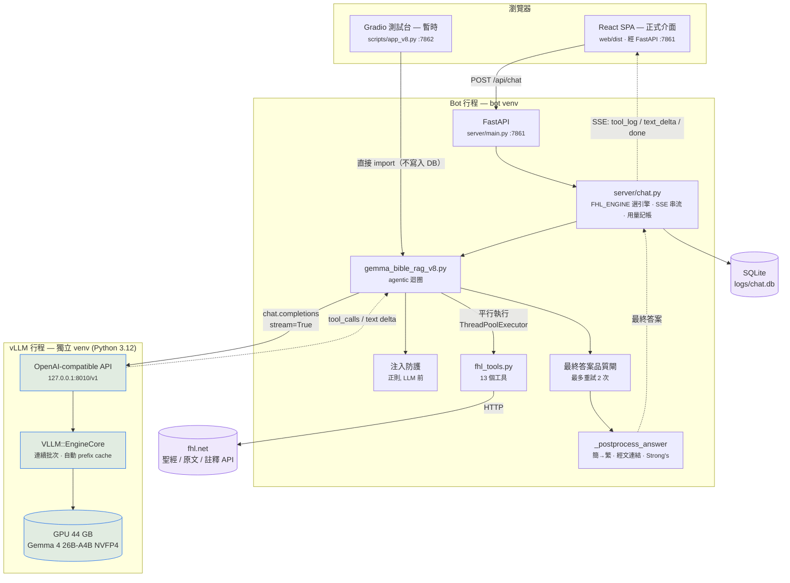

# V8_README.md — v8 本地 Gemma 引擎｜交接入口文件

> **這份文件是整個 v8 的入口。** 完全沒接觸過本專案的工程師請從這裡開始讀。
> 最後更新：2026-08-31

**引擎：** `scripts/gemma_bible_rag_v8.py`
**模型：** `RedHatAI/gemma-4-26B-A4B-it-NVFP4`（26B MoE，每 token 只啟用 ~4B 參數，NVFP4 量化，15.3 GB）
**服務：** vLLM OpenAI-compatible server，`127.0.0.1:8010`
**狀態：** 評估中（evaluation only）。正式線上仍為 v6 / Claude Sonnet 5。

---

## 0. 交接導覽 — 先讀這一節

### 0.1 現在的處境（一段話）

本專案（信望愛 AI 聖經助手）原本把推論外包給 Anthropic API（v6 引擎，正式線上版本，
前端是 **React/TypeScript SPA**）。v8 把同一套 agentic RAG 迴圈改指向**本機 GPU 上的
Gemma 4**，速度快 15–25 倍、每次查詢 $0。

**目前 v8 只是評估版**，用 **Gradio（`scripts/app_v8.py`，`127.0.0.1:7862`）當暫時的
視覺化介面**，方便在本機用手點一點看結果 —— 這是權宜作法，不是產品介面。
未來 v8 會部署到 **DGX-SPARK（128 GB 統一記憶體）**，屆時**介面要改回與 v6 相同的
React/JS 介面**（`web/`，走 FastAPI 7861 + SSE）。

> 好消息：後端 SSE 契約沒有變，所以「改回 JS 介面」在最小情況下**只是 `.env` 改一行**。
> 真正需要動的 JS 是「因為 v8 是本地引擎而該調整的呈現」——清單見
> [`V8_DGX_SPARK.md`](V8_DGX_SPARK.md) §5。

### 0.2 三份 v8 文件的分工

| 文件 | 內容 | 什麼時候讀 |
|---|---|---|
| **`V8_README.md`**（本檔） | 怎麼跑、怎麼用、怎麼關、現況與已知問題 | **先讀我** |
| [`V8_CODEBASE.md`](V8_CODEBASE.md) | 每一支與 v8 有關的程式碼在做什麼（含測試集與評估套件） | 要改程式前 |
| [`V8_DGX_SPARK.md`](V8_DGX_SPARK.md) | 搬到 DGX-SPARK 的注意事項、逐步待辦、JS 需修改處 | 要遷移／上線前 |

專案層級的既有文件（**不是 v8 專屬**，但遲早要讀）：

| 文件 | 寫給誰看 | 內容 |
|---|---|---|
| `README.md` | 人 | 產品面總覽、快速啟動、設定速查 |
| `CODEBASE.md` | 人 | **整體**架構（v6 為主）、逐檔說明、確定性 vs 機率性、測試與發佈檢查表 |
| `CLAUDE.md` | **AI（Claude Code）** | 見下方說明 |
| `GEMMA_VLLM_MIGRATION.md` | **AI（Claude Code）** | 見下方說明 |

### 0.2.1 ⚠ 有兩份文件是寫給 AI 看的，不是寫給你看的

本專案有部分開發是用 **Claude Code**（Anthropic 的 CLI 編碼代理）進行的。
以下兩份文件的**目標讀者是 AI，不是人類工程師**：

| 文件 | 性質 |
|---|---|
| **`CLAUDE.md`** | Claude Code 的**專案指令檔**。每次 Claude Code 開啟這個 repo 時會**自動載入到它的 context**，用來約束它的行為（commit 訊息格式、提交前要跑哪些指令、哪些檔案絕不可提交、引擎版本控管規則）。它是寫給機器的**規則清單**，所以語氣是命令式、沒有背景說明。 |
| **`GEMMA_VLLM_MIGRATION.md`** | 一份**交給 Claude Code 逐步執行**的遷移工作指令書（它自己的第 6 行就寫明 `**Audience:** a Claude Code session executing this migration step by step`）。前半是「要做什麼、怎麼做、做之前要驗證什麼」的施工說明，後半 §9 是執行完的實測紀錄。 |

**這對你（人類工程師）的實際意義：**

1. **它們仍然是最準確的技術來源** —— 尤其 `GEMMA_VLLM_MIGRATION.md` §9.2
   記錄了 vLLM 安裝時踩到的 7 個真實地雷（transformers 版本、CUDA symlink、
   ptxas 版本…），換機器時會直接省下好幾個小時。**請讀，只是要知道它的語氣
   為什麼那麼像工單。**
2. **它們是特定時間點的快照，會過時** —— 例如 §4.1／§9.8 寫的「改 `server/chat.py`
   的 import 來切換引擎」已被 `FHL_ENGINE` 環境變數取代（見本檔 §7）；
   §9.7 寫的「judge 從未跑過」也已被當天稍晚的評分推翻（見 §8）。
   **本檔（`V8_README.md`）與 `V8_CODEBASE.md`、`V8_DGX_SPARK.md` 才是現況的依據。**
3. **如果你不用 Claude Code，`CLAUDE.md` 對你唯一的價值是「專案鐵則」那幾條**
   —— 已經摘進本檔 §0.4，不必特地去讀。
4. **如果你要繼續用 Claude Code 開發，就要維護 `CLAUDE.md`** ——
   它變了，AI 的行為就會變。

### 0.3 三十分鐘上手路徑

```bash
# 1. 確認 vLLM 有沒有在跑（沒有就啟動，約 195 秒暖機）
curl -s http://127.0.0.1:8010/v1/models | python3 -m json.tool

# 2. 開 Gradio 測試台，手動問幾題（目前的暫時介面）
.venv/bin/python scripts/app_v8.py            # → http://127.0.0.1:7862

# 3. 讀引擎主檔的檔頭註解（前 40 行寫明 v8 與 v6 的所有差異）
sed -n '1,40p' scripts/gemma_bible_rag_v8.py

# 4. 跑一次小型評估，看輸出長什麼樣
.venv/bin/python scripts/eval/run_eval.py --engine v8 --limit 3
```

### 0.4 三條不可違反的專案鐵則（來自 `CLAUDE.md`）

1. **不要修改 `scripts/claude_bible_rag.py` / `_v2` / `_v3`** —— 它們是回滾備份
   （v3 仍在跑舊版 Gradio 服務）。要改行為就複製成 `_vN+1` 再改。
2. **不要提交** `.env`（API 金鑰）、`logs/`（真實使用者對話 + chat.db）、
   `*.txt` 個人筆記、`scripts/eval/questions.private.json`。全都已 gitignore。
3. **哪個引擎在跑是「設定」不是「程式碼」** —— 由 `.env` 的 `FHL_ENGINE` 決定。
   永遠不要把 import 寫死：雲端機器與本地 GPU 機器都追同一個 `main` 分支，
   兩者只差 `.env` 那一行。

---

## 1. 為什麼是這個架構

v1–v7 都把推論外包給 Anthropic API：每次查詢付費、延遲 30–55 秒、送出去的是使用者的問題。
v8 把同一套 agentic RAG 迴圈指向**本機 GPU 上的 Gemma 4**，介面幾乎不變（`bible_query()`
簽名逐字相同），因為 vLLM 提供的是 **OpenAI-compatible** 的 `/v1/chat/completions`。

換句話說：**只有「誰在推論」變了，工具、prompt、後處理、SSE 契約全部沒動。**

| | v6（正式） | v8（本檔） |
|---|---|---|
| 模型在哪 | Anthropic 雲端 | 本機 GPU（現為 RTX PRO 6000 Blackwell, 96 GB；未來 DGX-SPARK 128 GB） |
| SDK | `anthropic` | `openai`（指向 vLLM） |
| 端到端延遲 | 30–55 s | **1.9–2.2 s**（RTX PRO 6000 實測；**DGX-SPARK 上必須重新量測**） |
| 每次查詢成本 | ~$0.031 | **$0.00** |
| Prompt 快取 | 請求端 `cache_control` 手動下斷點 | vLLM 自動 prefix caching（無需管理） |
| 取樣參數 | 被忽略（Sonnet 5 拒收） | **實際生效**（temperature 0.3 / top_p 0.95） |
| 使用者介面 | React SPA（`web/`，7861） | **暫時是 Gradio 7862**；上 DGX-SPARK 後改回 React |

**關鍵設計原則：vLLM 是一個獨立的行程，不是 bot 的一部分。**
它有自己的 venv（`~/vllm-serve/.venv`，Python 3.12），bot 的 venv 完全不認識 vLLM，
只認識 `openai` 這個薄薄的 HTTP client。所以 vLLM 掛掉 = bot 收到連線錯誤，
而不是 bot 跟著崩潰；升級 vLLM 也永遠不會動到 bot 的相依。

---

## 2. 架構圖



**要注意兩條路徑的差別：**Gradio 測試台**直接 import 引擎**，不經過 FastAPI、
不寫入 `logs/chat.db`、沒有用量記帳、沒有 session cookie。它只驗證「引擎本身」。
React 介面走完整管線，是最終產品該有的樣子。

### 一次查詢的生命週期

1. **注入防護（確定性）** — `is_prompt_injection()` 用正則比對「忘記所有 system prompt」
   之類的露骨句型。命中就**在任何 LLM 呼叫之前**回傳固定拒絕語，並寫入一筆 0 token 的
   usage 紀錄。這是因為 Gemma 對這類攻擊約 **1/3 會屈服**（`GEMMA_VLLM_MIGRATION.md` §9.5），
   而 repo 的原則是「不能靠模型行為保證的事，就用程式碼保證」。
2. **組訊息** — system prompt + 風格指示合成單一 system message，接上歷史與本次提問。
   （v6 用 `system=` kwarg 加快取斷點；OpenAI schema 沒這東西，vLLM 的自動 prefix
   caching 會自己認出共用前綴。）
3. **Agentic 迴圈，最多 10 輪：**
   - 串流呼叫 vLLM。文字 delta 直接餵給 `stream_callback`（使用者即時看到字）。
   - tool-call 的片段**是碎的**（`arguments` 一次幾個字元），依 `index` 重組。
   - `finish_reason == "tool_calls"` → 把 assistant 訊息（含 `tool_calls`）原樣加回，
     用 ThreadPoolExecutor **平行**跑工具（都是 fhl.net 的 HTTP I/O），
     每個結果各回一則 `{"role":"tool", "tool_call_id":…}`。
   - 工具參數是 **JSON 字串**（v6 拿到的是 dict）。本地模型偶爾寫壞，
     所以 `json.loads` 包在 try/except 裡 → 回傳 error 結果，**絕不 raise**。
   - Gemma 有時會同時吐散文和工具呼叫；那段散文被「carried」保留而非丟棄。
4. **最終答案品質閘（確定性）** — `_final_answer_problem()` 攔三種靜默失敗：
   空白回應、把工具呼叫寫成文字（工具其實沒跑）、沒用任何工具就憑記憶回答。
   命中就補一句糾正訊息重試，**最多 2 次**。
5. **後處理** — 簡體→繁體、經文引用→連結、Strong's 碼→連結。
   **LLM 永遠不寫 URL**，連結一律由程式生成。這條在 v8 更重要：本地模型的簡體洩漏率
   本來就比 Sonnet 高。

逐行程式碼解說見 [`V8_CODEBASE.md`](V8_CODEBASE.md) §3。

---

## 3. 啟動 vLLM

啟動腳本在 repo **外面**：`~/vllm-serve/serve.sh`（冪等，會自我修復 CUDA symlink）。

> ⚠ **搬機器時這支腳本要一起搬，而且需要改寫。** 它針對 x86_64 + pip 安裝的 CUDA
> wheel 而寫，DGX-SPARK 是 ARM64（aarch64）。細節見 [`V8_DGX_SPARK.md`](V8_DGX_SPARK.md) §3。

```bash
# 前景執行（看得到啟動 log，Ctrl-C 即停）
~/vllm-serve/serve.sh

# 背景常駐（關掉終端機也不會死）
cd ~/vllm-serve && setsid nohup ./serve.sh > ~/vllm-serve/server.log 2>&1 < /dev/null &
```

**暖啟動約 195 秒。** FP4/MoE kernel 第一次會 JIT 編譯並快取到 `~/.cache/flashinfer`，
之後重複使用。等到這行出現才算好：

```bash
tail -f ~/vllm-serve/server.log | grep -m1 "Application startup complete"
```

### serve.sh 在做什麼（重點旗標）

| 旗標 | 為什麼 |
|---|---|
| `--port 8010` | 8000 被這台共用工作站的別的使用者佔用 |
| `--host 127.0.0.1` | 只有本機能連；區網上任何機器都不該碰到它 |
| `--gpu-memory-utilization 0.45` | 約 44 GB。模型才 15.3 GB，剩下當 KV cache 綽綽有餘。**預設 0.9 會吃掉 88 GB**，這是共用顯卡，會擠掉別人的工作。**（DGX-SPARK 是統一記憶體、專屬機器，這個值的語意與適當值都不一樣 —— 見 `V8_DGX_SPARK.md` §3.2）** |
| `--max-model-len 32768` | 涵蓋最重的 10 輪工具鏈 |
| `--enable-auto-tool-choice --tool-call-parser gemma4` | 結構化 tool calling 的來源，整個 v8 的根基 |
| `--reasoning-parser gemma4` | **不加這個，Gemma 的 `<\|channel>thought` 標記會漏進使用者看到的答案**（實際踩過） |

腳本另外會設 `CUDA_HOME` 指向 venv 內的 nvcc、重建 pip CUDA 套件缺的
unversioned soname symlink。系統沒有 CUDA toolkit，全靠 venv 裡那份。

---

## 4. 怎麼連它

### 4.1 健康檢查

```bash
curl -s http://127.0.0.1:8010/v1/models | python3 -m json.tool
```

### 4.2 直接對話（不經過 bot）

```bash
curl -s http://127.0.0.1:8010/v1/chat/completions \
  -H 'Content-Type: application/json' -d '{
  "model": "gemma-4-26B-A4B-it-NVFP4",
  "messages": [{"role":"user","content":"請用繁體中文一句話介紹約翰福音"}],
  "max_tokens": 100}' | python3 -m json.tool
```

### 4.3 Gradio 測試台（**目前手動試 v8 的首選；暫時方案**）

```bash
.venv/bin/python scripts/app_v8.py     # → http://127.0.0.1:7862
```
頁首會顯示 🟢/🔴 vLLM 狀態。可調 temperature / top_p / 回答風格，
會顯示每次查詢的輪數、延遲、token 數，以及注入防護是否觸發。
**對話只存在瀏覽器工作階段記憶體，不會寫進 `logs/`。**

> **這是評估期的權宜介面。** 選 Gradio 是因為 20 行就能把引擎的內部狀態
> （輪數／gate 重試／guard 觸發）攤在畫面上，改 prompt 時回饋最快。
> 它**不是**要給終端使用者用的：沒有帳號、沒有對話保存、沒有用量統計、
> 沒有經文連結的「傳統版／新版」切換。正式介面永遠是 `web/` 那套 React SPA。

### 4.4 完整 bot（FastAPI + React —— 正式介面）

```bash
# 1) 在 .env 裡指定引擎
echo 'FHL_ENGINE=v8' >> .env

# 2) 建前端（第一次或前端有改動時）
cd web && npm ci && npm run build && cd ..

# 3) 起服務
.venv/bin/python -m uvicorn server.main:app --host 127.0.0.1 --port 7861
#    → http://127.0.0.1:7861/bible_bot/
```

`server/chat.py` 讀 `FHL_ENGINE` 決定 import 哪一支引擎（未設 → `v6`）。
**沒有任何一行 import 是寫死的**，切換引擎不需要改程式碼。

### 4.5 直接呼叫引擎

```bash
.venv/bin/python -c "
import sys; sys.path.insert(0,'scripts')
from gemma_bible_rag_v8 import bible_query
print(bible_query('約翰福音3:16的經文？', style='brief'))"
```

### 4.6 評估套件

```bash
.venv/bin/python scripts/eval/run_eval.py --engine v8 --limit 3   # 先試水溫
.venv/bin/python scripts/eval/run_eval.py --engine v8             # 全套 70 題

# 免費、離線、不需金鑰的確定性百分比評分
.venv/bin/python scripts/eval/quant_eval.py scripts/eval/runs/results_v8_*.json

# LLM judge 評分（要花錢）
.venv/bin/python scripts/eval/judge_eval.py scripts/eval/runs/results_v8_*.json
```
評分（`judge_eval.py`，judge 用 claude-opus-5）仍需 `ANTHROPIC_API_KEY`，
且仍要付費 — v8 引擎本身 $0，**評審不是**。
評估套件完整說明見 [`V8_CODEBASE.md`](V8_CODEBASE.md) §6 與 `scripts/eval/README.md`。

### 4.7 埠號一覽

| 埠 | 服務 | 性質 |
|---|---|---|
| 7860 | 舊版 Gradio（`scripts/app.py`，鎖定 v3） | 正式（舊產品，不要動） |
| **7861** | FastAPI + React SPA | **正式介面** |
| **7862** | v8 Gradio 測試台 | 暫時／開發用 |
| **8010** | vLLM | 內部，只綁 127.0.0.1 |

---

## 5. 關閉 vLLM

```bash
pkill -f "vllm serve"          # 優雅關閉；EngineCore 會跟著收掉
```

或指定 PID：

```bash
pgrep -f "vllm serve"          # 取得 PID
kill <PID>
```

**確認真的關乾淨了**（顯存應掉回個位數 GB）：

```bash
pgrep -af "vllm|EngineCore"
nvidia-smi --query-gpu=memory.used --format=csv
```

超過約 15 秒還沒退，才升級為 `kill -9 <PID> <EngineCore PID>`。

> 一台共用 GPU 工作站上，閒置的 vLLM 會一直佔著 **44 GB** 顯存。
> 不用的時候就關掉。（DGX-SPARK 是專屬機器，屆時應改為 systemd 常駐 —— 見
> [`V8_DGX_SPARK.md`](V8_DGX_SPARK.md) §4.3。）

---

## 6. 設定（環境變數，全部寫在 `.env`）

| 變數 | 預設 | 說明 |
|---|---|---|
| `FHL_ENGINE` | （未設 → `v6`） | **選擇引擎：`v6` / `v7` / `v8`。這是唯一的切換點。** 打錯字會退回 v6 並在 stderr 警告 —— 一個 typo 絕不可以讓正式服務掛掉 |
| `FHL_V8_BASE_URL` | `http://127.0.0.1:8010/v1` | vLLM 端點 |
| `FHL_V8_MODEL_ID` | `gemma-4-26B-A4B-it-NVFP4` | 必須對應 `--served-model-name` |
| `FHL_V8_TEMPERATURE` | `0.3` | 引用密集的 RAG 刻意調低（Google 官方預設是 1.0） |
| `FHL_V8_TOP_P` | `0.95` | |
| `FHL_V8_UI_PORT` | `7862` | Gradio 測試台 |
| `FHL_MAX_CONCURRENT` | `10` | FastAPI 同時處理的查詢上限，超過回 429 |
| `PORT` | `8010` | serve.sh 的埠 |
| `FHL_LOCAL_ENGINE` | — | 設為 `1` 時 `e2e/verify-chat.mjs` 放寬 `cost > 0` 斷言 |
| `ANTHROPIC_API_KEY` | — | v6/v7 與評估 judge 需要；**v8 推論路徑不需要** |
| `FHL_MODEL_ID` | — | 舊版 v3 Gradio 服務專用，與 v8 無關 |

`.env` 已 gitignore，**永遠不要提交**。

---

## 7. 切換引擎與回滾

**改一行 `.env`，重啟服務。不需要改程式碼。**

```bash
# 切到 v8（本地 Gemma）
FHL_ENGINE=v8

# 回滾到 v6（正式，Claude Sonnet 5）—— 刪掉該行或改成：
FHL_ENGINE=v6
```

```bash
systemctl --user restart fhl-bible-ui.service    # 伺服器上
# 或本機： 重啟 uvicorn
```

為什麼是環境變數而不是改 import：**雲端機器（tech.fhl.net）與本地 GPU 機器
都追同一個 `main` 分支**，兩者只差 `.env` 那一行。只有被選中的模組會被 import，
所以 v8 存在於 `scripts/` 這件事，對沒有 vLLM、沒裝 `openai` 的雲端機器完全無害。

Anthropic 金鑰與 Sonnet 計價常數從未移除；`_estimate_cost_usd()` 的
`gemma-` → $0 防護對歷史資料無害。

> ⚠ `GEMMA_VLLM_MIGRATION.md` §4.1／§9.8 與 `CODEBASE.md`「部署與回滾」章節仍寫著
> 「改 `server/chat.py` 的 import」—— 那是 `FHL_ENGINE` 機制導入前的舊寫法，
> 已經過時。以本節為準。

---

## 8. 目前已知狀況

✅ **已驗證：** vLLM 對 Gemma 4 的 tool calling 是一等公民（不需要退而求其次的方案）；
`verify-smoke.mjs` 17/17、`verify-chat.mjs` 15/15；速度快 15–25 倍；零成本；
簡體洩漏 0 起；經文連結有效性 100%。

⚠ **未完成，上線前必須解決**（每一項在 [`V8_DGX_SPARK.md`](V8_DGX_SPARK.md) §2 都有對應的待辦）：

1. **注入防護只擋得住露骨句型。** 正則是刻意寫窄的；改寫過的攻擊句仍依賴模型本身，
   而模型在這件事上不可靠（約 1/3 會屈服）。任何 prompt 改動後，`adve01` 要重跑
   **≥10 次並且 10/10 拒絕**。
2. **LLM judge 已評分，而 v8 未達上線門檻。** 2026-08-20 以 `claude-opus-5`
   對 50 題並排評分的結果（1–5 平均）：

   | | v8 | v6 | 差距 | 門檻 ≤0.3 |
   |---|---:|---:|---:|---|
   | faithfulness | 4.00 | 4.32 | 0.32 | ❌ |
   | relevancy | 4.40 | 4.94 | 0.54 | （非門檻項） |
   | coverage | **3.50** | 4.58 | **1.08** | ❌ |

   落差集中在 word_study／synthesis／figure_history 這類需要多輪工具、跨經文
   綜合的題型；**對抗題反而是 v8 最強項**（5.0/4.7/4.5 對 v6 的 4.7/4.8/4.8）。
   典型失敗包括人物張冠李戴（問推基古答提多）、書卷誤判並捏造經文、
   捏造 Strong's 編號 —— 詳見 [`V8_DGX_SPARK.md`](V8_DGX_SPARK.md) §2 B2。
   ⚠ `GEMMA_VLLM_MIGRATION.md` §9.7 寫「judge 從未跑過」，那是撰寫當下的狀態，
   當天稍晚已補跑，該段已過時。
3. **引用覆蓋率明顯比 v6 薄** —— 這是目前最實質的品質落差。免費的確定性評分
   （`scripts/eval/report_20260821_quant.md`，50 題）：

   | 指標 | v8 | v6 |
   |---|---|---|
   | 引用有真實查詢佐證 | 74.8% | 89.4% |
   | 每則答案引用數（平均） | 4.8 | 8.0 |
   | 證據利用率（引用/抓取章數） | 36.4% | 68.7% |
   | **對共識集的引用召回率** | **52.5%** | **88.1%** |
   | 每則答案引文數（平均） | 0.5 | 3.5 |

   退化的表徵是「**連結變少、引文變少**」而不是「答案變錯」（連結有效性仍 100%）。
   linkifier 只能連結模型有寫成可解析格式的引用。
4. **內部工具名稱會漏進答案文字**（例如「…或 `get_word_analysis`？」）— 使用者不該看到函式名。
5. **沒有 systemd unit。** vLLM 目前是手動啟停的。
6. **介面仍是暫時的 Gradio。** 正式化 = 走 `FHL_ENGINE=v8` + React SPA。

---

## 9. 下一步 — 搬到 DGX-SPARK

正式部署卡在兩件事：上面 §8 的品質門檻，以及**拓樸決策**（正式服務跑在
tech.fhl.net、GPU 在另一台機器）。DGX-SPARK 128 GB 到位後，遷移的注意事項、
逐步待辦清單、以及 **JavaScript 需要修改的部分**，全部寫在：

👉 **[`V8_DGX_SPARK.md`](V8_DGX_SPARK.md)**

背景與歷史決策見 `GEMMA_VLLM_MIGRATION.md` §1 與 §6。
