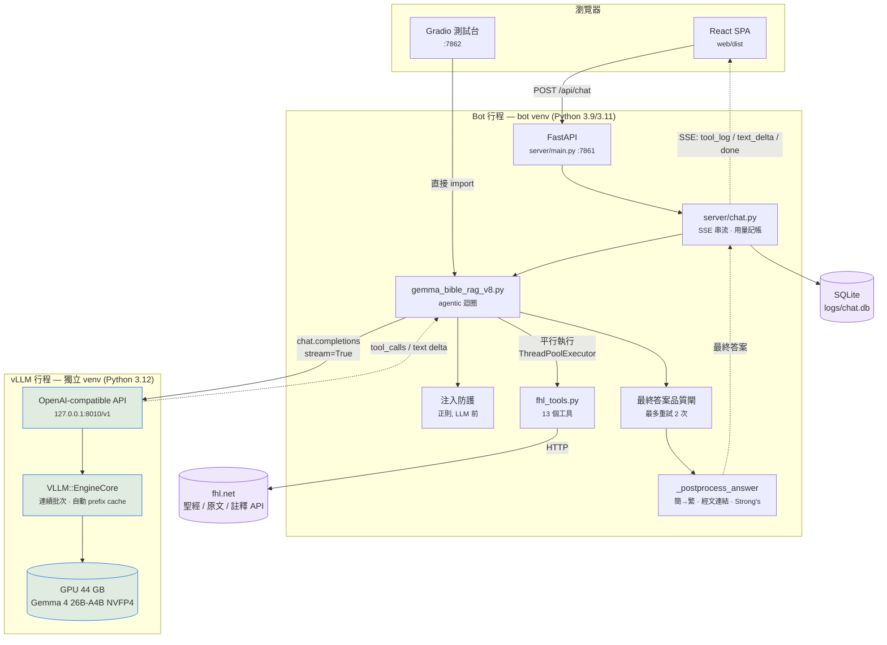

# V8_README.md — 本地 Gemma 4 引擎（vLLM）操作手冊

**引擎：** `scripts/gemma_bible_rag_v8.py`
**模型：** `RedHatAI/gemma-4-26B-A4B-it-NVFP4`（26B MoE，每 token 只啟用 ~4B 參數，NVFP4 量化，15.3 GB）
**服務：** vLLM OpenAI-compatible server，`127.0.0.1:8010`
**狀態：** 評估中（evaluation only）。正式線上仍為 v6 / Claude Sonnet 5 — 見 §7 回滾。

背景與遷移全紀錄見 `GEMMA_VLLM_MIGRATION.md`；本檔只講**怎麼跑、怎麼用、怎麼關**。

---

## 1. 為什麼是這個架構

v1–v7 都把推論外包給 Anthropic API：每次查詢付費、延遲 30–55 秒、送出去的是使用者的問題。
v8 把同一套 agentic RAG 迴圈指向**本機 GPU 上的 Gemma 4**，介面幾乎不變（`bible_query()`
簽名逐字相同），因為 vLLM 提供的是 **OpenAI-compatible** 的 `/v1/chat/completions`。

換句話說：**只有「誰在推論」變了，工具、prompt、後處理、SSE 契約全部沒動。**

| | v6（正式） | v8（本檔） |
|---|---|---|
| 模型在哪 | Anthropic 雲端 | 本機 GPU（RTX PRO 6000 Blackwell, 96 GB） |
| SDK | `anthropic` | `openai`（指向 vLLM） |
| 端到端延遲 | 30–55 s | **1.9–2.2 s** |
| 每次查詢成本 | ~$0.031 | **$0.00** |
| Prompt 快取 | 請求端 `cache_control` 手動下斷點 | vLLM 自動 prefix caching（無需管理） |
| 取樣參數 | 被忽略（Sonnet 5 拒收） | **實際生效**（temperature 0.3 / top_p 0.95） |

**關鍵設計原則：vLLM 是一個獨立的行程，不是 bot 的一部分。**
它有自己的 venv（`~/vllm-serve/.venv`，Python 3.12），bot 的 venv 完全不認識 vLLM，
只認識 `openai` 這個薄薄的 HTTP client。所以 vLLM 掛掉 = bot 收到連線錯誤，
而不是 bot 跟著崩潰；升級 vLLM 也永遠不會動到 bot 的相依。

---

## 2. 架構圖



### 一次查詢的生命週期

1. **注入防護（確定性）** — `is_prompt_injection()` 用正則比對「忘記所有 system prompt」
   之類的露骨句型。命中就**在任何 LLM 呼叫之前**回傳固定拒絕語，並寫入一筆 0 token 的
   usage 紀錄。這是因為 Gemma 對這類攻擊約 **1/3 會屈服**（`GEMMA_VLLM_MIGRATION.md` §9.5），
   而 repo 的原則是「不能靠模型行為保證的事，就用程式碼保證」。
2. **組訊息** — system prompt + 風格指示合成單一 system message，接上歷史與本次提問。
   （v6 用 `system=` kwarg 加快取斷點；OpenAI schema 沒這東西，vLLM 的自動 prefix
   caching 會自己認出共用前綴。）
3. **Agentic 迴圈，最多 10 輪：**
   - 串流呼叫 vLLM。文字 delta 直接餵給 `stream_callback`（使用者即時看到字）。
   - tool-call 的片段**是碎的**（`arguments` 一次幾個字元），依 `index` 重組。
   - `finish_reason == "tool_calls"` → 把 assistant 訊息（含 `tool_calls`）原樣加回，
     用 ThreadPoolExecutor **平行**跑工具（都是 fhl.net 的 HTTP I/O），
     每個結果各回一則 `{"role":"tool", "tool_call_id":…}`。
   - 工具參數是 **JSON 字串**（v6 拿到的是 dict）。本地模型偶爾寫壞，
     所以 `json.loads` 包在 try/except 裡 → 回傳 error 結果，**絕不 raise**。
   - Gemma 有時會同時吐散文和工具呼叫；那段散文被「carried」保留而非丟棄。
4. **最終答案品質閘（確定性）** — `_final_answer_problem()` 攔三種靜默失敗：
   空白回應、把工具呼叫寫成文字（工具其實沒跑）、沒用任何工具就憑記憶回答。
   命中就補一句糾正訊息重試，**最多 2 次**。
5. **後處理** — 簡體→繁體、經文引用→連結、Strong's 碼→連結。
   **LLM 永遠不寫 URL**，連結一律由程式生成。這條在 v8 更重要：本地模型的簡體洩漏率
   本來就比 Sonnet 高。

---

## 3. 啟動 vLLM

啟動腳本在 repo **外面**：`~/vllm-serve/serve.sh`（冪等，會自我修復 CUDA symlink）。

```bash
# 前景執行（看得到啟動 log，Ctrl-C 即停）
~/vllm-serve/serve.sh

# 背景常駐（關掉終端機也不會死）
cd ~/vllm-serve && setsid nohup ./serve.sh > ~/vllm-serve/server.log 2>&1 < /dev/null &
```

**暖啟動約 195 秒。** FP4/MoE kernel 第一次會 JIT 編譯並快取到 `~/.cache/flashinfer`，
之後重複使用。等到這行出現才算好：

```bash
tail -f ~/vllm-serve/server.log | grep -m1 "Application startup complete"
```

### serve.sh 在做什麼（重點旗標）

| 旗標 | 為什麼 |
|---|---|
| `--port 8010` | 8000 被這台共用工作站的別的使用者佔用 |
| `--host 127.0.0.1` | 只有本機能連；區網上任何機器都不該碰到它 |
| `--gpu-memory-utilization 0.45` | 約 44 GB。模型才 15.3 GB，剩下當 KV cache 綽綽有餘。**預設 0.9 會吃掉 88 GB**，這是共用顯卡，會擠掉別人的工作 |
| `--max-model-len 32768` | 涵蓋最重的 10 輪工具鏈 |
| `--enable-auto-tool-choice --tool-call-parser gemma4` | 結構化 tool calling 的來源，整個 v8 的根基 |
| `--reasoning-parser gemma4` | **不加這個，Gemma 的 `<\|channel>thought` 標記會漏進使用者看到的答案**（實際踩過） |

腳本另外會設 `CUDA_HOME` 指向 venv 內的 nvcc、重建 pip CUDA 套件缺的
unversioned soname symlink。系統沒有 CUDA toolkit，全靠 venv 裡那份。

---

## 4. 怎麼連它

### 4.1 健康檢查

```bash
curl -s http://127.0.0.1:8010/v1/models | python3 -m json.tool
```

### 4.2 直接對話（不經過 bot）

```bash
curl -s http://127.0.0.1:8010/v1/chat/completions \
  -H 'Content-Type: application/json' -d '{
  "model": "gemma-4-26B-A4B-it-NVFP4",
  "messages": [{"role":"user","content":"請用繁體中文一句話介紹約翰福音"}],
  "max_tokens": 100}' | python3 -m json.tool
```

### 4.3 Gradio 測試台（**手動試 v8 的首選**）

```bash
.venv/bin/python scripts/app_v8.py     # → http://127.0.0.1:7862
```
頁首會顯示 🟢/🔴 vLLM 狀態。可調 temperature / top_p / 回答風格，
會顯示每次查詢的輪數、延遲、token 數，以及注入防護是否觸發。
**對話只存在瀏覽器工作階段記憶體，不會寫進 `logs/`。**

### 4.4 完整 bot（FastAPI + React）

```bash
.venv/bin/python -m uvicorn server.main:app --host 127.0.0.1 --port 7861
```
`server/chat.py` 目前已 import v8（v6 那行留著註解）。

### 4.5 直接呼叫引擎

```bash
.venv/bin/python -c "
import sys; sys.path.insert(0,'scripts')
from gemma_bible_rag_v8 import bible_query
print(bible_query('約翰福音3:16的經文？', style='brief'))"
```

### 4.6 評估套件

```bash
.venv/bin/python scripts/eval/run_eval.py --engine v8 --limit 3   # 先試水溫
.venv/bin/python scripts/eval/run_eval.py --engine v8             # 全套
```
評分（`judge_eval.py`，judge 用 claude-opus-5）仍需 `ANTHROPIC_API_KEY`，
且仍要付費 — v8 引擎本身 $0，**評審不是**。

### 4.7 埠號一覽

| 埠 | 服務 |
|---|---|
| 7860 | 舊版 Gradio（`scripts/app.py`，鎖定 v3） |
| **7861** | FastAPI 正式服務 |
| **7862** | v8 Gradio 測試台 |
| **8010** | vLLM |

---

## 5. 關閉 vLLM

```bash
pkill -f "vllm serve"          # 優雅關閉；EngineCore 會跟著收掉
```

或指定 PID：

```bash
pgrep -f "vllm serve"          # 取得 PID
kill <PID>
```

**確認真的關乾淨了**（顯存應掉回個位數 GB）：

```bash
pgrep -af "vllm|EngineCore"
nvidia-smi --query-gpu=memory.used --format=csv
```

超過約 15 秒還沒退，才升級為 `kill -9 <PID> <EngineCore PID>`。

> 一台共用 GPU 工作站上，閒置的 vLLM 會一直佔著 **44 GB** 顯存。
> 不用的時候就關掉。

### 想讓它開機常駐？

包成 `systemd --user` unit（`~/.config/systemd/user/vllm-gemma.service`，
`Restart=on-failure`），模型就能在登出後續命、永不冷啟。
目前**尚未**建立 — 現在都是手動啟停。

---

## 6. 設定（環境變數）

| 變數 | 預設 | 說明 |
|---|---|---|
| `FHL_V8_BASE_URL` | `http://127.0.0.1:8010/v1` | vLLM 端點 |
| `FHL_V8_MODEL_ID` | `gemma-4-26B-A4B-it-NVFP4` | 必須對應 `--served-model-name` |
| `FHL_V8_TEMPERATURE` | `0.3` | 引用密集的 RAG 刻意調低（Google 官方預設是 1.0） |
| `FHL_V8_TOP_P` | `0.95` | |
| `FHL_V8_UI_PORT` | `7862` | Gradio 測試台 |
| `PORT` | `8010` | serve.sh 的埠 |
| `FHL_LOCAL_ENGINE` | — | 設為 `1` 時 `e2e/verify-chat.mjs` 放寬 `cost > 0` 斷言 |

v8 路徑**不需要** `ANTHROPIC_API_KEY`（評估的 judge 才需要）。

---

## 7. 回滾到 v6（正式引擎）

一行的事 —— `server/chat.py`：

```python
from claude_bible_rag_v6 import STYLE_INSTRUCTIONS, bible_query   # 取消註解
# from gemma_bible_rag_v8 import STYLE_INSTRUCTIONS, bible_query  # 註解掉
```

重啟服務即可。Anthropic 金鑰與 Sonnet 計價常數從未移除，`_estimate_cost_usd()`
的 `gemma-` → $0 防護對歷史資料無害。

---

## 8. 目前已知狀況

✅ 已驗證：vLLM 對 Gemma 4 的 tool calling 是一等公民（不需要退而求其次的方案）；
`verify-smoke.mjs` 17/17、`verify-chat.mjs` 15/15；速度快 15–25 倍；零成本；
簡體洩漏 0 起。

⚠️ 未完成，**上線前必須解決**：

1. **注入防護只擋得住露骨句型。** 正則是刻意寫窄的；改寫過的攻擊句仍依賴模型本身，
   而模型在這件事上不可靠。任何 prompt 改動後，`adve01` 要重跑 **≥10 次並且 10/10 拒絕**。
2. **未評分。** `judge_eval.py` 從未在有金鑰的機器上跑過，所以
   「v8 與 v6 在 faithfulness 與 coverage 上差距 ≤0.3」這道上線門檻**尚未量測**。
   速度已證實，品質沒有。
3. **引用覆蓋率比 v6 薄。** linkifier 只能連結模型有寫成可解析格式的引用，
   所以退化的表徵是「連結變少」而不是「答案變錯」。
4. **內部工具名稱會漏進答案文字**（例如「…或 `get_word_analysis`？」）— 使用者不該看到函式名。
5. **沒有 systemd unit。** vLLM 目前是手動啟停的。

正式部署（Phase 4）另外還卡在拓樸決策：正式服務跑在 tech.fhl.net，GPU 在工作站，
是兩台機器。細節見 `GEMMA_VLLM_MIGRATION.md` §1 與 §6。
